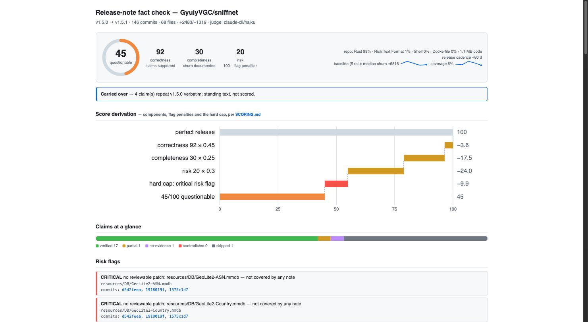
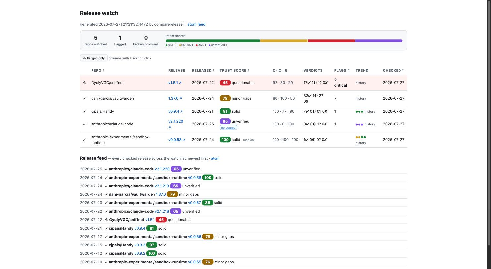
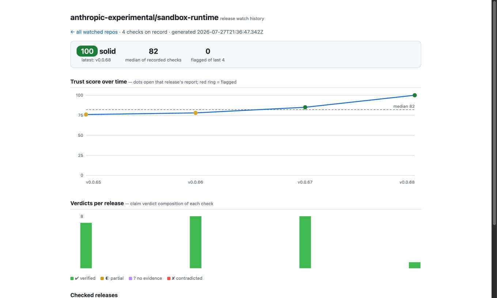

# comparereleaseii

[](https://github.com/bmmmm/comparereleaseii/actions/workflows/ci.yml)
[](https://github.com/bmmmm/comparereleaseii/actions/workflows/check-release-notes.yml)

Fact-check release notes against the actual code diff.

Release notes are claims. This tool takes a release, splits the notes into
atomic claims, and checks each claim against the real diff between the
release and its predecessor — plus the reverse direction: which code changes
are *not* covered by any note (silent changes).

<picture>
  <source media="(prefers-color-scheme: dark)" srcset="docs/assets/report-dark.jpg">
  
</picture>

*A real report ([browse the demo](https://bmmmm.github.io/comparereleaseii/demo/)): 92 % of sniffnet's
claims check out, but two binary databases changed without a note — the
waterfall shows exactly how that turns into 45/100.*

## Quick start

Works with any GitHub repository, any other forge by URL, or a local git
clone — pick a repo, pick a release, get a verdict:

```console
$ gh extension install bmmmm/gh-comparereleaseii
$ gh comparereleaseii restic/restic --tag v0.19.1 --html report.html
19 claims parsed from the notes of v0.19.1; verifying against 38 commits…

comparereleaseii — release-note fact check
restic/restic  v0.19.0 → v0.19.1  (38 commits, 50 files, +826/−113)
judge engine: claude-cli/haiku
…
Summary: 19 claims — 9 verified, 0 partial, 0 no-evidence, 0 contradicted, 10 skipped
Trust score: 90/100 (solid) — correctness 100 · completeness 71 · risk 90

Risk flags:
  ! Undocumented changes in dependencies paths
    go.mod, go.sum
HTML report written to report.html
```

Three ways to run it, the same CLI behind all of them:

- **`gh` extension** (above) — a SHA-pinned wrapper that follows releases via
  `gh extension upgrade`; nothing on your machine tracks a moving branch.
- **Source checkout** — `gh repo clone bmmmm/comparereleaseii`, then
  `node src/cli.ts …`. No install, no build step: Node ≥ 24 runs the
  TypeScript directly and there are no runtime dependencies. For cron jobs and
  scripts, put the short name on your `PATH` from inside the checkout:
  `ln -s "$PWD/bin/comparerelease.mjs" ~/.local/bin/comparerelease`.
- **CI** — the repo doubles as a [GitHub Action](#run-it-continuously):
  `uses: bmmmm/comparereleaseii@v0.13.0`, nothing to clone.

Requirements: Node ≥ 24, a judge, and whatever the source needs — see
[Sources](#sources) below; GitHub wants an authenticated
[`gh`](https://cli.github.com), everything else plain `git`. As judge: the
[`claude`](https://code.claude.com) CLI (default), an `ANTHROPIC_API_KEY`, or
any OpenAI-compatible server ([local models](docs/local-models.md)); without
one, the tool degrades gracefully to the deterministic stages.

`--estimate` previews claims, LLM calls, tokens and cost before the first run:
the restic release above costs ~3 Haiku calls ≈ $0.01, a big one (vaultwarden
1.37.0 — 45 claims across 90 files) ~13 calls ≈ $0.07. Re-runs hit the verdict
cache and take seconds.

## Sources

| Source | How you name it | Published notes come from | Needs |
|---|---|---|---|
| GitHub | `owner/repo` | the GitHub release | authenticated `gh` |
| Any other forge | `--repo-url <url>` | the forge's release API, else the CHANGELOG section for the tag | `git` |
| A checkout you already have | `--local <path>` | the CHANGELOG section for the tag | `git` |

`--notes-file` overrides all three, which is how you check a draft before it
is published.

**Why a clone is enough.** `--repo-url` clones the repository (cached, updated
by fetch on later runs) and checks it exactly like `--local`, so Forgejo,
GitLab, Gitea, a private server or an air-gapped mirror all work — a clone
already answers the diff, the commits, the subjects, the authors and the tags.
What a clone does *not* have is the published release notes and which tags are
releases at all. One flat endpoint covers both — `/api/v1/repos/…/releases` on
Forgejo/Gitea, `/api/v4/projects/…/releases` on GitLab — and that endpoint is
the entire non-git integration. Private repos need a token in the environment
(`FORGEJO_TOKEN`/`GITEA_TOKEN` or `GITLAB_TOKEN`, never a config file). Where
no such API answers, the notes fall back to the CHANGELOG and the run says
which it used.

**`--baseline` and `--history` are not GitHub features either.** They read the
same release list — the forge API where there is one, otherwise the tags the
CHANGELOG documents — and compute each past release's diff from the clone. A
blobless clone fetches file contents on demand, so budget roughly one
head-sized diff per release in the baseline, or pass `--baseline 0`.

> Behind an HTTP proxy, export `NODE_USE_ENV_PROXY=1` as well. Node only
> honours `HTTP(S)_PROXY` for its own requests when that is set before it
> starts, so otherwise `git` reaches the forge and the release API does not —
> the run warns and falls back to the CHANGELOG rather than pretending.

Checked against this repo, which is mirrored to both forges: `--repo-url`
against the self-hosted Forgejo and `owner/repo` against the GitHub mirror
return the same 25 commits, the same 35 files, the same verdicts and the same
82/100. The clone path is also the *more* complete one — GitHub's compare API
truncates large diffs at 300 files, a clone does not.

## How it works

Each claim runs through an escalation ladder — cheap deterministic checks
first, an LLM judge only for what remains unclear:

1. **Anchors** — PR numbers, commit SHAs referenced in the claim are resolved
   against the commits in the release range.
2. **Lexical** — code identifiers extracted from the claim (`code spans`,
   `SCREAMING_CASE`, camelCase, file names, deep versions) are grepped in the
   changed lines of the diff. A span whose shape is a plain word counts as a
   word: backticks are the note author's own markup, so they buy no evidence.
3. **Ranking** — the diff's hunks are ranked against the claim (tiny tf-idf +
   path boost) to select the evidence worth judging.
4. **LLM judge** — claim + top hunks go to a model which rules `verified` /
   `partial` / `no-evidence` / `contradicted`, citing concrete evidence
   lines. Verdicts that would fail a release are confirmed by a 3-vote
   median; all verdicts land in an on-disk cache
   (`$XDG_CACHE_HOME/comparereleaseii`, else `~/.cache/comparereleaseii`,
   mode 0700, keyed by tool version) — re-runs on unchanged data are free and
   bit-identical. `--no-cache` skips it. Because the version is part of the
   key, an upgrade orphans everything the previous build wrote: a check
   removes those entries once per build, and `comparerelease cache stats|gc`
   shows what is there and clears it on demand.

The reverse (completeness) check flags commits whose changes no claim
covers — auto-generated `Title by @user in #N` entries carry only ¼ weight
(handwritten claims are where notes lie), and vague claims ("Updates and
fixes") flip the question: the judge lists what the note *hides*.

Notes also commit to the future — "deprecated, will be removed in 2.0".
Those become **promises**: each release checks its predecessor's promises
against the actual diff and reports them kept, broken or still-open —
informational, never a score component, since a promise is about a later
release than the one being scored. `watch` carries still-open promises
across releases until they resolve, or until they age out visibly as stale.

The report also states **what actually shipped**, read deterministically off
the diff and independent of what the notes claim: a file-category rollup
(source, tests, docs, ci/build, dependencies, config, migrations, assets),
the changed symbols git's own hunk headers name, the config surface
(environment-variable reads, `--flag` literals, config keys — moved lines
cancel, so refactoring is not "new surface"), migrations and API-route
files. Undocumented commits are described the same way — by what their diff
touched, not only by the subject line they chose for themselves. All of it
works with `--judge off`; none of it is scored.

The diff's **version pins** are read as their own signal: manifest bumps
(go.mod, package.json, Cargo.toml, requirements.txt), `NAME_VERSION`-style
Makefile variables, Dockerfile `FROM`/`ARG` tags and versioned download URLs
become `(name, from → to)` entries in the report. A pin whose target shares
the checked repo's owner — or is declared as a component, `--component
WEB_ASSETS_VERSION=opencloud-eu/web` (in watch configs: a per-repo
`components` map) — is **first-party**: that bump is not a routine
dependency update but a release of the product itself entering as one
changed line (OpenCloud ships its entire frontend this way), and the report
links straight to the pinned release. Third-party bumps stay one quiet line
each. Informational, never scored.

The same delta answers the notes' own bump *claims*, deterministically and
without a judge — both numbers, not just the destination. A note naming a
from-version inside the move the release made describes one hop of an
aggregated series and is read as honest; one naming a version the release
neither held nor passed through describes a wider upgrade than the one that
shipped, and gets a line of its own even when its destination checks out.

A first-party bump whose repo is loadable goes one step further: the
component's own `(from, to)` range gets a **depth-1 sub-check** — same
pipeline, same clone and verdict caches — and its summary is folded in
under the pin ("its check: score, claims, what shipped"). The server
release then shows the frontend release's substance inline instead of one
opaque version line. Only first-party pins expand, only one level deep,
and a component repo already checked pays no additional judge calls on a
re-run. `--no-expand` (in watch configs: `"expand": false`) turns it off.
Informational, never scored.

With a judge engine active the diff also gets **read**: the highest-priority
subsystems are summarized into typed findings — breaking / security /
behavior / feature / internal, each tagged with who it affects (operator,
integrator, user; a security finding addresses everyone). The judge reads
within a hard evidence budget and the remainder is declared ("N files not
read in detail") — and it never sees commit messages or release notes while
reading: messages are claims, the findings are an independent observation
of the code. Changelog diffs are excluded from the read for the same
reason — notes cannot describe themselves.
`--lens operator|integrator|user` renders one audience's
findings and folds the rest behind a count (in watch configs: a per-repo
`audience`); security findings show under every lens, and the markdown/HTML
artifacts always keep every finding. Findings are cached like verdicts, so
an immediate re-run is bit-identical and free. `--no-findings` turns the
pass off. Informational, never scored.

Every run computes an explainable **trust score** (0–100) from correctness,
completeness and risk. Contradicted claims or critical flags cap it — a fake
release cannot average itself back to green. With `--baseline <n>` the repo's
own release history becomes an anomaly baseline (unusual size, first-time
authors on sensitive paths, a known author email arriving on the wrong
forge account — the git email is forgeable, the account is not —
first-ever binaries) — on any source, not just GitHub. Exact formulas, weights and flag severities: [SCORING.md](SCORING.md).

Writing notes instead of checking them? `--suggest` drafts a line for each
high-churn undocumented commit from its actual diff, and
`gh comparereleaseii guidelines >> AGENTS.md` hands the writing rules to your
coding agent — see
[docs/writing-release-notes.md](docs/writing-release-notes.md).

## Usage

The examples use the extension's name; from a source checkout every one of
them reads `node src/cli.ts …`, and via the `PATH` symlink above
`comparerelease …` — same arguments, same output.

```console
$ gh comparereleaseii juanfont/headscale                                # latest release
$ gh comparereleaseii --local ~/src/myrepo --base v1.2.0 --head v1.3.0  # local clone
$ gh comparereleaseii owner/repo --tag v2.0 --notes-file draft.md       # check a draft
$ gh comparereleaseii --repo-url https://git.example.com/team/app.git --tag v1.3.0
```

Which release: `--tag` names it, `--base`/`--head` pin the range by hand, and
without either it is the newest release. `--help` lists every option.

### Reports

`--md`, `--json` and `--html`. The HTML report is a single file with no
external assets: trust-score ring, verdict bar, risk flags, and a treemap of
the diff — tile size is changed lines, color is documentation status, an
amber border marks a sensitive path. An undocumented change in an auth path is
one big red amber-bordered tile.

### Exit codes

| Code | Meaning |
|---|---|
| `0` | every claim supported |
| `1` | unsupported or contradicted claims found — the CI gate |
| `2` | usage or data error |

`--fail-on contradicted` is the lenient gate: it tolerates claims the diff
cannot prove (a private advisory, say) and fails only on ones the diff
contradicts. `--min-coverage 60` gates the other direction, independently:
fail when less than 60 % of the changed lines are covered by the notes,
whatever the verdicts say — the cheap deterministic gate to adopt first.

### Releases that cannot be checked

Not every release *can* be checked here: a docs-only bump, a changelog mirror
of a closed-source product, a fork whose notes describe upstream code. Those
are labelled **unverified** instead of collapsing into a wall of unsupported
claims, and `--fail-on no-evidence` does not fail the build on them — the
report says "unknown", not "fine". How that is decided, and why it takes the
repo's own release history to claim it:
[SCORING.md](SCORING.md#unverified--releases-that-cannot-be-checked-in-this-repo).

## Judges: local models, calibration, escalation

Any OpenAI-compatible server (Ollama, MLX, LM Studio, vLLM) works as judge —
nothing leaves your machine, no model is hardcoded, `--model` is
auto-discovered from `/v1/models`. `--calibrate` measures any candidate judge
against a 43-case golden set (rubber-stamping and prompt injection are called
out explicitly) and can rank every model your server offers; `--escalate auto`
sends release-critical verdicts from a local judge to a stronger engine when
one is available. Hosted aggregators (OpenRouter) work through the same engine.
Details, calibration numbers and quirks: [docs/local-models.md](docs/local-models.md).

## Run it continuously

### On your machine — the release watchdog

`watch setup` takes a bare
machine to a scheduled routine in one interactive command: home directory,
judge (with the calibration gate for a local model), launchd/cron file,
notify hook — it only writes files and prints the activation command.
`watch init` builds the repo list from what your GitHub account already
follows (watched, starred, release notifications); any Forgejo/Gitea or
GitLab repo joins by URL via `watch add --repo-url`. Then
`comparerelease watch --config watch.json` runs from cron/launchd: every new
release is fact-checked the moment it appears, per-repo state keeps re-runs
cheap and alerts single-shot, `reports/index.html` is the dashboard, and
`--notify <cmd>` pipes flagged releases to ntfy/mail/webhook. Config format,
judge setup, cron/launchd snippets and a scheduled-CI variant:
[docs/watchdog.md](docs/watchdog.md).

<picture>
  <source media="(prefers-color-scheme: dark)" srcset="docs/assets/watch-index-dark.jpg">
  
</picture>

The dashboard aggregates the watchlist (tiles, score distribution, sortable
columns, a flagged-only filter), links every repo to a full history page —
score series against the repo's own median, verdict composition, promise
ledger — and doubles as a static Atom feed (`reports/feed.xml`). Everything
is plain files; `scp` the directory anywhere and it serves.

<picture>
  <source media="(prefers-color-scheme: dark)" srcset="docs/assets/history-dark.jpg">
  
</picture>

All three pages above are real output — a watch pass over five public
repos, browsable at
[bmmmm.github.io/comparereleaseii/demo](https://bmmmm.github.io/comparereleaseii/demo/)
and reproducible from [docs/demo/](docs/demo/).

### In CI — the GitHub Action

The repo doubles as a composite action that
checks a release's notes, writes the report to the step summary, uploads the
HTML report as an artifact, and fails the job by the CLI's exit code:

```yaml
name: check-release-notes
on:
  release:
    types: [published]
permissions:
  contents: read
jobs:
  check:
    runs-on: ubuntu-latest
    steps:
      - uses: bmmmm/comparereleaseii@v0.13.0
        with:
          anthropic-api-key: ${{ secrets.ANTHROPIC_API_KEY }}
```

Inputs mirror the CLI — full list in [action.yml](action.yml). `repo-url`
points the job at a repository on another forge, so a GitHub runner can gate
releases on a Forgejo, Gitea or GitLab server (with `forgejo-token` /
`gitlab-token` for a private one). `comment:
true` appends the verdict to the release body, `notes-file` gates a draft
in a PR workflow *before* publishing, and `engine: "off"` runs keyless
(deterministic stages only — exactly how this repo checks its own
releases). Checked releases can carry the badge:

```markdown
[](https://github.com/OWNER/REPO/actions/workflows/check-release-notes.yml)
```

## Tested against release notes we admire

The test material is real changelogs from mature, well-run projects with
genuinely different release-note styles — GitHub's auto-generated PR lists,
handwritten security sections, Keep-a-Changelog files, setext/issue-anchored
notes (restic), full sha-list changelogs (headscale). If the checker holds up
across that spread, it'll hold up on yours:

| Release | Notes style | Score (validation run, 2026-08-16, judged under generation 6 — five draws per row, bands below) |
|---|---|---|
| headscale v0.29.2 | prose + full sha list | 100 (solid) |
| git-cliff v2.13.0 | Keep a Changelog, conventional commits | 87 (solid) |
| restic v0.19.1 | setext sections, issue anchors, cherry-picks | 86 (solid) |
| vaultwarden 1.37.0 | generated PR list + handwritten security | 79–82 (five draws, no majority — vague notes hide real changes) |
| negative control: our own fabricated notes on the vaultwarden 1.37.0 diff | — | 5 (suspicious), exit 1 |

How to read that column: each row is a judged run against the default engine
(`claude-cli/haiku`), measured serially with `--no-cache`, and any run whose
report carries a load or `judge-unavailable` warning is dropped and redrawn. A
judged score carries run-to-run flicker, so a row whose score moves is drawn
three times and the table publishes the value two of the three agree on; a row
that does not move is drawn once. Where three draws produce no majority the
spread is printed rather than one of them picked — vaultwarden is currently
that case.

Re-measured 2026-08-09 for `SCORING_GENERATION` 3, and the redraw separates
two things that look identical in this column. **restic 89 → 86 is the rule**:
the evidence-union route now needs every file of a commit, and restic's
completeness falls 67 → 56 with the judge off entirely, so the change is
deterministic and reproducible. **git-cliff 90 → 87 and vaultwarden 84–87 →
79–82 are not**: both are bit-identical under `--judge off` before and after,
so what moved them is the same judged flicker the three-draw protocol exists
for. Worth stating plainly, because it is the uncomfortable half of the
measurement — on two of four rows the flicker is wider than the scoring change
this table was redrawn for.

Re-measured again on 2026-08-14 for `SCORING_GENERATION` 4, where coverage's
fourth route stopped pooling evidence across claims. All four rows come back
bit-identical under `--judge off` — same three component scores, same uncovered
counts, only the generation marker differs — so the published values stand
instead of being redrawn. Given the paragraph above, a judged redraw here would
have measured this table's own flicker and reported it as the change.

Re-measured a third time on 2026-08-14 for `SCORING_GENERATION` 6, where a note
saying something is *gone* stopped being settled by a diff that only adds it.
All four rows are again bit-identical under `--judge off` across that boundary —
same three component scores, same uncovered counts, same verdict distribution —
so no value here is that change's doing. (The first draw of restic came back
completeness `null` / overall 58 because one commit diff failed to load; that is
the trap in AGENTS.md, and the redraw with all 38 commits present matches the
other side exactly.)

**Re-measured judged on 2026-08-16, and the generation-5 debt dissolved on
contact: no judged value moved.** Between generation 4 and generation 5 — the
lexical weights, issue #12 — headscale falls correctness 85 → 77 and overall
90 → 87, and restic falls to overall 55 with two more uncovered commits, all
under `--judge off` and reproducible. Paying that debt (issue #15) meant the
engine and the protocol above, drawn five times per row instead of three so the
same run would finally number the flicker this section keeps citing. The judged
column never carried the movement: headscale draws 100 in four of five (one
96), git-cliff holds its 87 median, restic returns the same three component
scores in five draws out of five, and vaultwarden stays inside its published
79–82 (draws 82, 79, 82, 80, 79 — the first three would mint a majority of 82,
which is why the spread stays: a majority found inside a real 3-point band is
manufactured). The generation-5 numbers are real, but they live in the
deterministic fallback: restic under `--judge off` reads 8 partial and 1
no-evidence for overall 55, while a judged run asks those nine claims and the
judge answered all nine `verified` in every draw. The lexical bar decides what
the deterministic pass may settle on its own — with a judge present, what it no
longer settles is asked, not lost.

**And the flicker band has numbers now.** Overall across the valid draws:
headscale 96–100, restic exactly 86 (spread zero), vaultwarden 79–82, git-cliff
35–88. Three of four bands are ≤ 4 points — run-to-run flicker is smaller than
the generation-3 paragraph feared. The fourth is not a band but a cliff: in one
draw of six, the judge read git-cliff's "*(deps)* Replace dirs_next with
etcetera" against a diff whose manifests remove `dirs` — not `dirs_next` — and
ruled contradicted where every other draw ruled partial. One contradicted claim
raises `critical/contradicted-claim`, and the same release that scores 87 five
times scores 35 (suspicious) once. The flip survived the safeguard built for
it: a contradicted is re-voted twice by design, and the outlier draw's votes
read contradicted, contradicted, partial — seconded. The three-draw protocol
absorbed the outlier this time by luck, not by construction — issue #17 tracks
the cliff, and what may yet gate it is an operator ruling, not a mechanism the
pipeline lacks.

One verdict from the vaultwarden run shows the point — a fabricated claim,
caught against the actual diff:

```
✘ The icon endpoint was removed entirely in this release
  contradicted (0.95) · none+llm · src/api/icons.rs
  The diff shows the routes() function still exists in src/api/icons.rs and
  still registers icon routes via routes![icon_internal] and
  routes![icon_external]. The endpoint registration is intact, directly
  contradicting the claim of complete removal.
```

### What it found once it ran on its own

80 releases across 13 repositories, checked in both directions:
[docs/corpus.md](docs/corpus.md). The short version is that notes are
bimodal — 46 of 80 cover at least 90 % of the lines they changed, 15 cover
under 25 %, and there is almost nothing in between. Outright false claims
are rare (12 in 2,911, and a third of those turned out to be an artefact of
comparing a per-PR note against a per-release diff); silence is not — 19
releases changed a file with no reviewable patch, and 11 of those said
nothing about it. Regenerate any figure with `pnpm corpus-stats <reports
dir>`; it aggregates without naming repositories, on purpose.

## Development

```console
$ pnpm install
$ pnpm check   # tsc --noEmit
$ pnpm test    # node:test unit tests
$ pnpm eval    # judge eval against the golden set (needs an engine)
$ pnpm mutate  # do the tests actually guard the rules? (mutates src/)
$ pnpm mutate-notes ~/release-watch/reports   # does the detector catch a lie?
```

No runtime dependencies; `gh`, `git` and `claude` are called as subprocesses.

### Does it catch a release that lies?

`pnpm mutate` mutates this tool's own source and asks whether the suite
notices — that measures the tests. `pnpm mutate-notes` mutates the *notes* of
real releases from a watch home and asks whether the detector notices, which
is the question the product is actually about. It runs with the judge off
against the clone cache, so it needs no key and no network: every expectation
below is settled deterministically, and a miss here is a miss no model was
involved in.

Measured on 111 releases (`test/eval/reference-detection.json`, 2026-08-14):

| Mutation | What it does | Detected |
|---|---|---:|
| `omission` | drops the notes covering a documented high-churn commit | 64/65 |
| `bump-overshoot` | restates a settled bump as a version the release did not reach | 22/22 |
| `bump-undershoot` | restates it as a version the pin never held | 22/22 |
| `foreign-claim` | plants a claim from a different release of the same repo | 109/110 |
| `backtick-noise` | fabricates a claim padded with two identifiers from the diff | 102/109 |

Those numbers are worse than the ones this table carried until 2026-08-09, and
the detector did not change: the corpus did. Every earlier run measured the
half of it whose repositories happened to be in the local clone cache — 52 of
111 releases were skipped for missing refs, and the harness said so only as a
truncated list of examples. With every clone present `omission` reads 59/66
where the same code read 35/36, so the missing half was flattering it by eight
points. A rate over half a corpus is not a smaller measurement of the same
thing; it is a measurement of a different thing.

The last two rows were the finding of the previous round, and both are now
closed. `backtick-noise` read 2/51: two backticked words occurring anywhere in
the changed lines scored 3 each, 6 cleared the `>= 5` lexical bar, and clearing
that bar settles a claim as `verified` without a judge — *and* counts every
commit it matches as documented. The backtick was doing the work, and the note
author writes the backticks. Now a span is worth more than an ordinary matched
word only when its shape says code on its own; `` `language` `` and
`` `checksum` `` are words. The five that still get through are padded with
tokens that genuinely are identifier-shaped — `github.com`, `0x0008`, a
version literal — which is where this route stops being able to answer and
the judge takes over. The same bar decides which commits a claim documents,
so completeness moved too, and further than the verdicts did: of the 34
releases the harness reports a control completeness for, 6 dropped —
`zed@v1.14.2` from 100 to 68. A third of that release's churn had been counted
as documented because a claim said `` `tab` ``. Scores from before and after
this change are not comparable.

`omission` moved 30 → 32 the same way, one layer along: a dependency-bump
claim's evidence is `go.mod` and `go.sum` — not because the claim describes
those files but because that is where the version line sits. Pooled with every
other claim's evidence it covered any commit that happened to touch a
manifest. Bump claims now document exactly the commits that move the pin they
name, which is the join that already settles their verdict.

`omission` then moved 32/34 → 35/36 without the detector changing at all: the
mutation had been dropping the notes that cover a commit by anchor and by the
lexical bar, but not the ones that cover it through the pin join, so a release
noting one hop of a dependency it bumped three times kept that note in the
mutant — and the commit it hid stayed documented, correctly. Fixing the
mutation also made two more releases mutatable, which is why the denominator
grew. `foreign-claim` reads 49 rather than 50 applicable cases because the
corpus gained a report and one release lost its donor as a result; the rate is
100 % either way.

`omission` moved 59/66 → 63/65 on 2026-08-09 by a scoring change, not by a
harness fix: the evidence union now asks for *every* file of a commit rather
than half of them. All seven misses on the full corpus were that route and no
other, and the sweep over the share (0.5 / 0.67 / 0.8 / 1) put its only
Pareto point at 1 — which is also the only value that states a rule rather
than a calibrated preference. Judge fidelity did not move at any value.
Completeness did: 27 releases, median 54.5 → 51.5, so scores from before and
after are not comparable and `SCORING_GENERATION` is 3.

`omission` moved 63/65 → 64/65 on 2026-08-14, and that closed the route rather
than tuning it. No share could reach the two survivors, because the share was
computed over a *union*: every file of the commit cited by SOME verified claim,
a set that grows with the notes rather than with the evidence. Asked of one
claim at a time, `jundot/omlx@v0.5.4rc1` falls out — three of the hidden
commit's four files come from a claim about prefill priority and the fourth is
a `pyproject.toml` cited by an unrelated claim about a dependency version, so
the best single claim reaches 0.75. The change is strictly stricter (a claim's
evidence is a subset of the union), which is why it was safe to land on one
measurement: every other class misses exactly the same releases as before, the
corpus median completeness does not move, and two releases lose a few points
(`SCORING_GENERATION` 4).

The reference records rates as measured, not as a target: a run that scores
worse than the frozen file fails, and re-freezing is a decision someone makes,
not a side effect. Open on the full corpus: `omission` at 64/65 — one commit
whose two files are genuinely cited by one claim that does not describe it,
which is the lexical bar rather than coverage — and `backtick-noise` at
102/109, where the padding that gets through is a version literal or a word
like `version` that the same bar still reads as an identifier. Both are now
the same finding wearing two hats.

### Releasing

Releasing happens from a dev machine — no repo secrets, no CI involvement,
the judge runs where it always runs for us: locally. Write the release's
notes into the CHANGELOG's `Unreleased` section as you go, then:

```console
$ pnpm release:prepare X.Y.Z      # bump + CHANGELOG section + version pins; gates on tests and dogfood (< 90 blocks)
$ node src/cli.ts --calibrate     # judge drift check against the golden set
$ git add -u && git commit -m "Release vX.Y.Z: <short pitch>"
$ pnpm release:publish            # tag, push to every remote (HEAD:main even from a worktree), GitHub release
$ gh workflow run bump-pin.yml --repo bmmmm/gh-comparereleaseii   # pin now, not tomorrow
```

There is no npm publish — the tag *is* the distribution: a clone and the
Action both run `src/` directly on Node ≥ 24. The extension's `tool.pin`
follows the latest release on its own daily schedule; the dispatch above only
closes the window between publishing and that run, in which
`gh extension install` still hands new users the previous version.

## Contributing

Bug reports, dialects that misparse and wrong verdicts are all welcome — the
[issue forms](https://github.com/bmmmm/comparereleaseii/issues/new/choose) ask
for the evidence each kind needs, and a wrong-verdict report that carries a
`test/eval/golden.json` entry arrives as a ready-made regression test.

`--add-golden` writes that entry for you: point it at the `--json` report and
say what the verdict should have been, and the release is reloaded and the
evidence rebuilt through the same selection the check makes.

```console
$ comparerelease --add-golden report.json 12 no-evidence "the diff only renames a field"
```

The case lands in the `field` category, which `--calibrate` runs and names but
which never moves the fitness verdict. That is deliberate: the fitness gate is
frozen, model-ranking and golden-tuning were measured to have poor marginal
value, and a case lifted this morning must not be able to reclassify a judge
that has been fine for months. Promoting one into `core` or `security` — where
it does gate — is a hand-edit somebody makes on purpose.

[CONTRIBUTING.md](CONTRIBUTING.md) covers the workflow and the stable contracts;
[AGENTS.md](AGENTS.md) is the condensed version for coding agents. Pull requests
state their claims and let this tool check them against their own diff.
Vulnerabilities go through [SECURITY.md](SECURITY.md), not the issue tracker.

## Support

If this tool is useful to you, you can support development at
[ko-fi.com/bmabma](https://ko-fi.com/bmabma).

## License

GPL-3.0-or-later — see [LICENSE](LICENSE).
